<div align="center">
  

  <br />

<a href="https://mohamed-taha-bayoumi.com">website</a>
&nbsp;·&nbsp;
<a href="https://www.linkedin.com/in/mohamed-taha-bayoumi/">linkedin</a>
&nbsp;·&nbsp;
<a href="mailto:bayoumi.internships@gmail.com">email</a>

</div>

## `$ whoami`

I'm Taha, a software engineer based in Paris, currently in New York City working on distributed systems at **Datadog**.

I enjoy building systems that have to be fast, observable, and correct—especially control planes, performance tooling, interpreters, and the occasional CLI that probably did not need to become a full project.

My background is in **computer science & applied mathematics** at Télécom Paris, followed by an MSc focused on **parallel & distributed systems** at Institut Polytechnique de Paris. Along the way, I've worked on ML inference at Huawei and developer/performance tooling.

```text
focus      distributed systems · systems programming · performance engineering
languages  Go · Rust · C/C++ · Python · SQL
systems    Linux · Docker · Kubernetes · Kafka · Redis · RPC
tools      GDB · Valgrind · PMUs · CUDA · a suspicious number of tmux sessions
```

## `$ cat current_status.txt`

```diff
+ building control-plane systems for high-throughput infrastructure
+ exploring better ways to make complex systems easier to operate
+ always happy to talk about Go, performance, distributed systems, or weird CLIs
```

## `$ uptime --human`

- Built systems across infrastructure, ML performance, and developer tooling.
- Interested in the space where algorithms meet real machines and real constraints.
- Two-time **SWERC** participant.
- Based between **Paris** and **New York City**—depending on what the scheduler decided.

<details>
<summary><code>$ ./idkfa</code> &nbsp;—&nbsp; definitely not an easter egg</summary>

```text
╔══════════════════════════════════════════════════════════════╗
║  ACCESS GRANTED                                      64 FPS  ║
║                                                              ║
║  HEALTH  100%    ARMOR  100%    COFFEE  [██████████░░]       ║
║                                                              ║
║  OBJECTIVE: make it fast, make it observable,                ║
║             make it boring to operate.                       ║
║                                                              ║
║  STATUS: NOCLIP ENABLED                                      ║
╚══════════════════════════════════════════════════════════════╝
```

Achievement unlocked: you inspect things before clicking them. We would probably get along.

</details>

<!--
  SOURCE-LEVEL EASTER EGG FOUND.
  There are two hard problems in computer science:
  cache invalidation, naming things, and off-by-one errors.
-->

<div align="center">
  <sub>Thanks for stopping by. Insert coin to continue.</sub>
</div>
